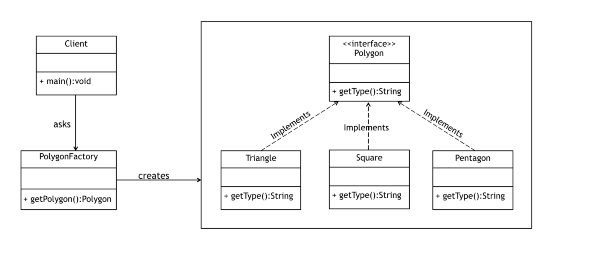

## Factory Pattern

Factory Pattern is one of the Creational Design pattern.

The factory design pattern is used when we have a superclass with multiple sub-classes and based on input, we need to return one of the sub-class. This pattern takes out the responsibility of the instantiation of a class from the client program to the factory class.

Super class in factory design pattern can be an interface, abstract class or a normal java class

### Factory Design Pattern Advantages
* Factory design pattern provides approach to code for interface rather than implementation.
* Factory pattern removes the instantiation of actual implementation classes from client code. Factory pattern makes our code more robust, less coupled and easy to extend. 
* Factory pattern provides abstraction between implementation and client classes through inheritance.

### When to Use Factory Method Design Pattern
* When the implementation of an interface or an abstract class is expected to change frequently
* When the current implementation cannot comfortably accommodate new change
* When the initialization process is relatively simple, and the constructor only requires a handful of parameters.