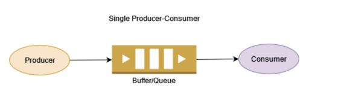

## Producer Consumer Pattern

Producer and Consumer are two separate processes. Both processes share a common buffer or queue. The producer continuously produces certain data and pushes it onto the buffer, whereas the consumer consumes those data from the buffer.

[Reference](https://www.baeldung.com/java-producer-consumer-problem)